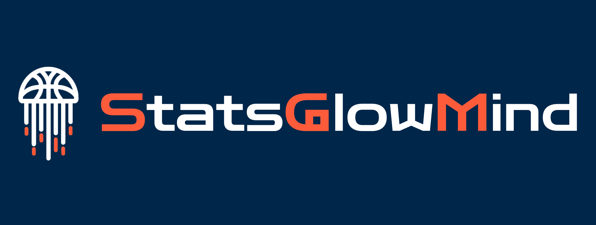

<div style="text-align: center;">
  
</div>

# StatsGlowMind

StatsGlowMind es una aplicación web dedicada a la Asociación Nacional de Baloncesto (NBA), una plataforma que va más allá de la simple exhibición de estadísticas y resultados, para ofrecer una serie de funcionalidades diseñadas para informar, analizar y predecir.

Esta aplicación proporciona información en tiempo real de la NBA, asi como la clasificación de la temporada, el cuadro de los playoffs, el calendario con los partidos y sus resultados, los líderes de la liga dependiendo de la categoria deseada y estadísticas de los todos los equipos y jugadores de la NBA. Se pueden observar los términos de baloncesto empleados en la aplicación en el Glosario.

StatsGlowMind tiene la capacidad de proporcionar análisis de jugadores en tiempo real, aprovechando las estadísticas de los juagdores en cada partido de la temporada, realizando así gráficas de análisis que muestran el rendimiento de los jugadores durante la temporada de la liga.

Además, esta aplicación va más allá, al ofrecer predicciones sobre los resultados de los partidos futuros que puede seleccionar el usuaro. Integrando un modelo con el algoritmo Random Forest de Machine Learning entrenado con datos históricos de la temporada actual, la aplicación proporciona a los usuarios la probabilidad de victoria de cada equipo, agregando más interés y emoción al seguimiento de la temporada de la NBA.

Se puede acceder a la aplicación desde el siguiente enlace: [StatsGlowMind](https://statsglowmindtfg.web.app/)

## Instalación en local:

Antes de instalar el proyecto localmente, es imprescindible instalar estos 2 componentes:

* **Node.js (npm)**: Para instalar las dependencias de Angular.
* **Python (pip)**: Para instalar las dependencias de Python.

Pasos para instalar el proyecto en local:

* Clonar repositorio GitHub:
    * ``` git clone https://github.com/roberlastrass/StatsGlowMind.git ```
    * ``` cd StatsGlowMind ```
* Instalar las dependencias de Angular:
    * ``` cd stats-glow-mind ```
    * ``` npm install ```
* Instalar las dependencias de Python:
    * ``` cd functions ```
    * ``` pip install -r requirements.txt ```
* Ejecutar el proyecto:
    * ``` ng serve ``` o ``` npm run start ```
* Visualizar aplicación:
    * http://localhost:4200/

Para más información puedes acudir a la documentación de los anexos del proyecto, exactamente en la Documentación técnica de programación (Apéndice D).

## Desarrollo:

Este proyecto esta desarrollado con las siguientes herramientas:

* **Angular**: Es un potente framework de desarrollo web que utiliza TypeScript, HTML y CSS.
* **Firebase**: Es un plataforma en la nube que facilita el proceso de creación, desarrollo y gestión de aplicaciones web. En este proyecto se han utilizado las siguientes funcionalidades de Firebase:
    * **Authentication**: Para la autenticación de usuarios.
    * **Firestore Database**: Para la base de datos.
    * **Hosting**: Para desplegar la aplicación.
    * **Storage**: Para almacenar archivos.
    * **Cloud Functions**: Para el desarrollo backend mediante funciones en la nube.
* **RapidAPI**: Es una plataforma que te permite utilizar y gestionar una amplia gama de APIs de forma centralizada.
    * **API-NBA**: Es la API que he usado para mostrar información en tiempo real de la NBA.

## Diseño:

Para el diseño de la aplicación web se ha utilizado:

* **Bootstrap**: Biblioteca que facilita el desarrollo web y un diseño resposive.
* **Angular Material**: Módulo de Angular que proporciona componentes para visualizar más atractiva la aplicación.
* **Chart.js**: Librería de JavaScript que sirve para representar datos en forma de gráficos de barras, circulares o líneas.
* **Flaticon**: Fuente de iconos en Internet, donde se han obtenido los iconos de la aplicación.

## Funcionamiento de la aplicación:

A continuación, se muestra un vídeo explicativo sobre el funcionamiento de la aplicación [StatsGlowMind](https://statsglowmindtfg.web.app/):

[](https://www.youtube.com/watch?v=altIjLMnB2c)

## Contacto:

Puedes contactar conmigo para cualquier consulta acerca de la aplicación StatsGlowMind a través de correo electrónico: ```rls1004@alu.ubu.es```

------------------------------------------------------------------------------------------------------------------------------------

# StatsGlowMind

StatsGlowMind is a web application dedicated to the National Basketball Association (NBA), a platform that goes beyond simple exhibition of statistics and results to offer a range of features designed to inform, analyze, and predict.

This application provides real-time information on the NBA, as well as the season standings, the playoff bracket, the schedule with matches and results, the league leaders by the desired category, and statistics for all NBA teams and players. You can find the basketball terms used in the application in the Glossary.

StatsGlowMind has the ability to provide real-time player analysis, leveraging player statistics from each season game, thus generating analytical graphs that show player performance throughout the league season.

Additionally, this application goes further by offering predictions on the outcomes of future matches that the user can select. By integrating a model with the Random Forest Machine Learning algorithm trained with historical data from the current season, the application provides users with the probability of each team winning, adding more interest and excitement to following the NBA season.

You can access the application at the following link: [StatsGlowMind](https://statsglowmindtfg.web.app/)

## Local Installation:

Before installing the project locally, it is essential to install these 2 components:

* **Node.js (npm)**: To install Angular dependencies.
* **Python (pip)**: To install Python dependencies.

Steps to install the project locally:

* Clone the GitHub repository:
    * ``` git clone https://github.com/roberlastrass/StatsGlowMind.git ```
    * ``` cd StatsGlowMind ```
* Install Angular dependencies:
    * ``` cd stats-glow-mind ```
    * ``` npm install ```
* Install Python dependencies:
    * ``` cd functions ```
    * ``` pip install -r requirements.txt ```
* Run the project:
    * ``` ng serve ``` or ``` npm run start ```
* View the application:
    * http://localhost:4200/

For more information, you can refer to the project's annex documentation, specifically in the Programming Technical Documentation (Appendix D).

## Development:

This project is developed with the following tools:

* **Angular**: A powerful web development framework using TypeScript, HTML, and CSS.
* **Firebase**: A cloud platform that simplifies the process of creating, developing, and managing web applications. In this project, the following Firebase functionalities are used:
    * **Authentication**: For user authentication.
    * **Firestore Database**: For the database.
    * **Hosting**: To deploy the application.
    * **Storage**: To store files.
    * **Cloud Functions**: For backend development using cloud functions.
* **RapidAPI**: A platform that allows you to use and manage a wide range of APIs in a centralized manner.
    * **API-NBA**: The API used to display real-time NBA information.

## Design:

For the web application design, the following were used:

* **Bootstrap**: A library that facilitates web development and responsive design.
* **Angular Material**: An Angular module that provides components to make the application more visually appealing.
* **Chart.js**: A JavaScript library used to represent data in bar, pie, or line charts.
* **Flaticon**: An online source for icons, from which the application's icons were obtained.

## Contact:

You can contact me for any inquiries about the StatsGlowMind application via email: ```rls1004@alu.ubu.es```
